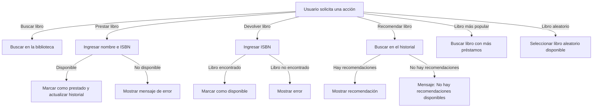

# Proyecto: P3 CORBA

## Proyecto
En este proyecto implementamos un sistema de una gestión de una biblioteca utilizando **CORBA** en Java.

## Versiones Usadas
- **Java:** 8
- **IDL Compiler:** `idlj`
- **ORB (Object Request Broker):** `tnameserv`

## Ejecución del Proyecto
### 1️⃣ **Compilar el IDL**
Ejecuta el siguiente comando para generar las clases necesarias desde `Biblioteca.idl`:
```zsh
idlj -fall Biblioteca.idl
```

### 2️⃣ **Compilar los archivos Java**
```zsh
javac -classpath . ServidorBiblioteca.java ClienteBiblioteca.java Biblioteca/*.java
```

### 3️⃣ **Ejecutar el servicio de nombres**
En la primera terminal:
```zsh
tnameserv -ORBInitialPort 1050
```

### 4️⃣ **Ejecutar el servidor**
En una nueva terminal:
```zsh
java ServidorBiblioteca -ORBInitialPort 1050 -ORBInitialHost localhost
```

### 5️⃣ **Ejecutar el cliente**
En una nueva terminal:
```zsh
java ClienteBiblioteca -ORBInitialPort 1050 -ORBInitialHost localhost
```

## Funcionalidades Añadidas
Se han agregado nuevas funciones a la biblioteca:

✅ **Sistema de Recomendaciones:**
   - `recomendarLibro(String usuario)`: Sugiere un libro basándose en el historial del usuario.

✅ **Sistema de Popularidad:**
   - `libroMasPopular()`: Devuelve el libro más alquilado.

✅ **Modo "Libro Aleatorio"**
   - `libroAleatorio()`: Permite obtener un libro aleatorio de la biblioteca.

✅ **Actualización del Historial del Usuario**
   - `prestarLibroUsuario(String ISBN, String usuario)`: Registra en el historial cuando un usuario alquila un libro.

## Diagrama de Flujo
